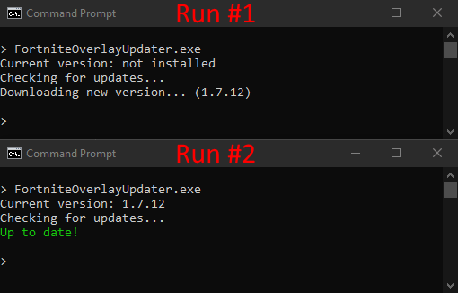

# Generic Auto Updater

* Checks web resource on launch and compares it to local version.
* Updates if neccesary.
* Automatically downloads and extracts to %localappdata%
* Falls back to local version if update check fails.
* Arguments passed to the updater exe are passed on to the program.

# Remote server manifest file

A .json with latest release info, the location of this file should never change.

```JSON
{
    "version": "1.0.0.0",
    "download": "https://example.com/myapp/myapp-v1.0.0.0.zip"
}
```

# Arguments passed to msbuild:

```
autoupdater_manifest_url
autoupdater_program_exe_name
autoupdater_use_shell_execute [optional, default false]
autoupdater_run_elevated [optional, default false]
```

Example:
```bat
set autoupdater_manifest_url=https://example.com/myapp/manifest.json
set autoupdater_program_exe_name=MyApp
set icon=myicon.ico

dotnet build /p:autoupdater_manifest_url=%autoupdater_manifest_url%;autoupdater_program_exe_name=%autoupdater_program_exe_name%;ApplicationIcon=%icon% --configuration Release --framework net7.0 --no-self-contained
dotnet publish --configuration Release --framework net7.0 --no-self-contained --runtime win-x64 --no-build
if NOT ["%errorlevel%"]==["0"] pause
```

# Screenshot

